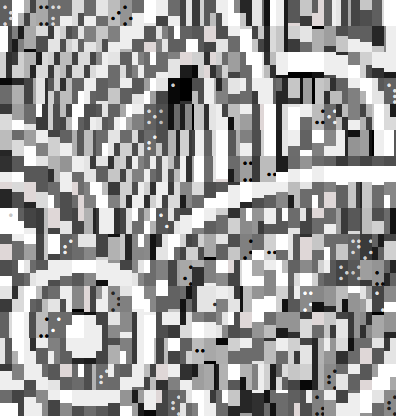

# chafa-rust (wip)

Rust bindings for [chafa](https://github.com/hpjansson/chafa), a library for displaying images in the terminal.

## Demo

Using a convenience function: `examples/image2ansi.rs`

```rust
use chafa::{image2ansi, QuickConfig, Symbols};

fn main() {
    let output = image2ansi("examples/test.png", QuickConfig{ 
        cols: 33,
        rows: 16,
        quality: 0.9,
        symbols: Symbols::BLOCK | Symbols::BRAILLE,
    }).unwrap();
    println!("{}", output);
}
```

| Before                                       | After                                                               |
|----------------------------------------------|---------------------------------------------------------------------|
|  |  |

Or using the normal chafa API: `examples/demo.rs`

```rust
use chafa::{Canvas, Config, PixelType, SymbolMap, Symbols};

fn main() {
    // see https://hpjansson.org/chafa/ref/chafa-using.html
 
    const PIX_WIDTH : i32 = 3;
    const PIX_HEIGHT : i32 = 3;
    const N_CHANNELS : i32 = 4;
    let pixels : [u8; (PIX_WIDTH * PIX_HEIGHT * N_CHANNELS) as usize] = [
        0xff, 0x00, 0x00, 0xff, 0x00, 0x00, 0x00, 0xff, 0xff, 0x00, 0x00, 0xff,
        0x00, 0x00, 0x00, 0xff, 0xff, 0x00, 0x00, 0xff, 0x00, 0x00, 0x00, 0xff,
        0xff, 0x00, 0x00, 0xff, 0x00, 0x00, 0x00, 0xff, 0xff, 0x00, 0x00, 0xff
    ];

    let symbol_map = SymbolMap::new();
    symbol_map.add_by_tags(Symbols::ALL);

    let config = Config::new();
    config.set_geometry(23, 12);
    config.set_symbol_map(symbol_map);

    let canvas = Canvas::new(config);

    canvas.draw_all_pixels(PixelType::RGBA8_UNASSOCIATED,
                           &pixels,
                           PIX_WIDTH,
                           PIX_HEIGHT,
                           PIX_WIDTH * N_CHANNELS);

    let output : String = canvas.build_ansi();

    println!("{}", output);
}
```

## Build

- Uses `rustc --version` `1.65.0`

- Dependencies: `chafa` and `glib` must be installed. See the [chafa installation page](https://hpjansson.org/chafa/download/), the [compilation page](https://hpjansson.org/chafa/ref/chafa-building.html), and my notes at `chafa-sys/build.rs::main`.

- `git clone https://github.com/wong-justin/chafa-rust.git`

- `cd chafa-rust && cargo build`

- Confirm that the example works by running `cargo run --example image2ansi`

---

Note: I'm new to both `chafa` and Rust's FFI binding process, so things may be a bit broken.

Looking for help: configuring builds + compilation, especially for Windows and Mac
